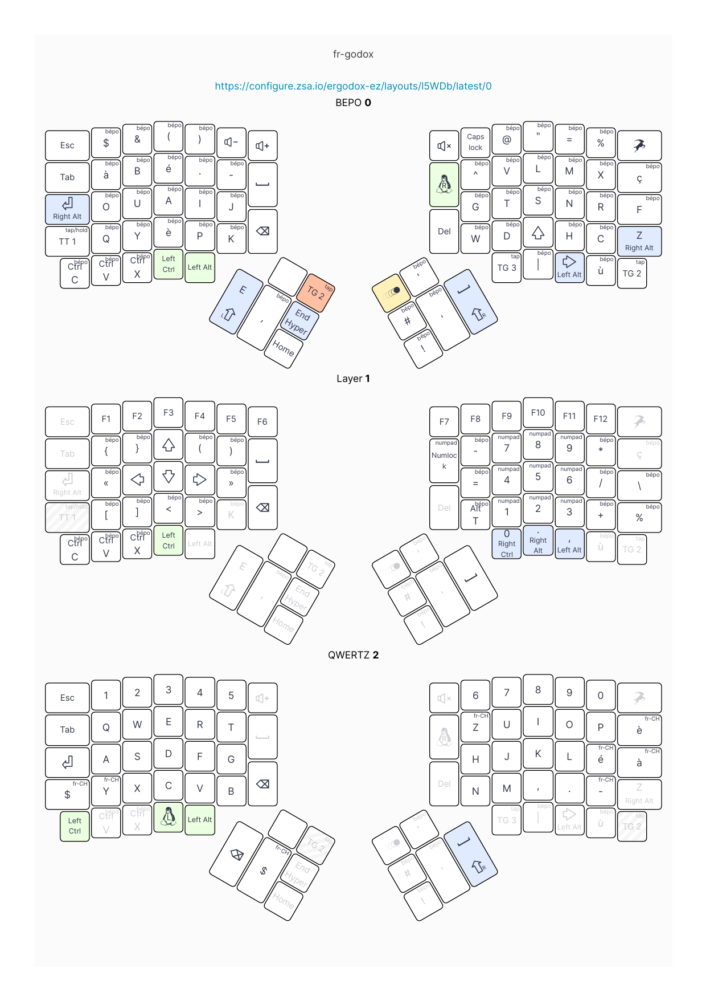
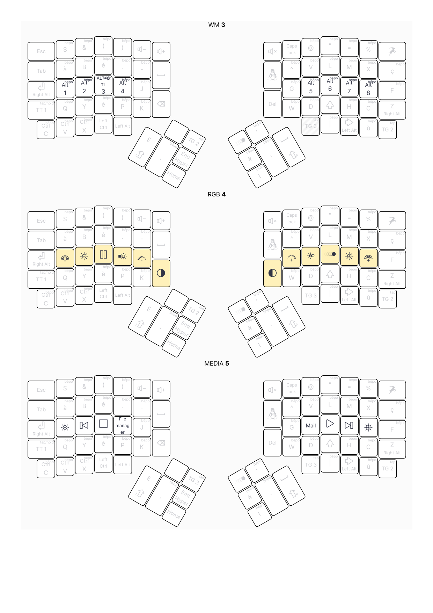

# fr-godox

[fr-godox](https://bepo.fr/wiki/Utilisateur:Kawamashi#Le_FR-Godox), is a bepo-based layout improved for the ergodox-ez keyboard.
This version only adds a few layers/shortcuts that I found usefull for my
daily basis (the first 2 layers are the same as the original).




# Compiling
First, make sure you have [qmk properly installed](https://docs.qmk.fm/#/newbs_getting_started).
Then, go to qmk_firmware project root and compile the firmware:

```bash
$ cd <YOUR_PATH>/qmk_firmware
$ make qmk setup
$ make ergodox_ez/shine:fr_godox

```

This will generate a **.hex** file at the project's root. It is the firmware
you will need to flash to your ergodox-ez keyboard.

To do this, you can either flash the firmware from
the [command line](https://docs.qmk.fm/#/newbs_flashing) or by using
ZSA's flashing tool, aka [Wally](https://www.zsa.io/wally/).
